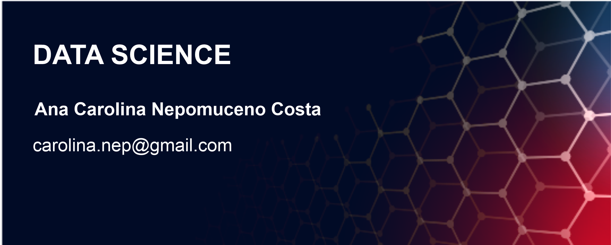

  

  
<a href="http://www.freepik.com">Designed by starline / Freepik</a>

# :sparkles: Ana Carolina Nepomuceno Costa
Ms Modeling and Quantitative Methods at the Federal University of Ceara - UFC

My academic background includes a work-in-progress Master's degree in Modeling and Quantitative Methods at the Federal University of Ceará (UFC), a postgraduate degree in mathematics teaching for high school at the State University of Ceara (UECE), and a bachelor's degree in mathematics from the Federal Institute of Education, Science, and Technology of Ceará State (IFCE). I hold certifications in Artificial Intelligence from Huawei and Microsoft Azure. Additionally, I possess experience in Data Science and Data Analytics, and I am currently seeking remote opportunities in the field of Data Science and Machine Learning utilizing Python. Also, I have experience teaching mathematics in schools, which has enhanced my communication skills.

My expertise lies in Statistics, Python, Machine Learning, BI, and MLOps for Data Science.

I am actively seeking new opportunities in the realm of Data Science and Machine Learning, with a focus on utilizing the Python language.

* :large_blue_diamond: [LinkedIn](https://www.linkedin.com/in/anacarolinanepomuceno/?locale=en_US)
* :mailbox_with_mail: **Contact:** carolina.nep@gmail.com;
* :bar_chart: **Main stacks:** Analysis with Tableau, Data Science, and Machine Learning using Python;
* :bulb: **Experience:** 3 years with a Math teacher and 1 year with Data Science, Analytics;
* :books: **Main Libs in Python:** Pandas, Numpy, SciPy, Seaborn, Matplotlib, Skitplot, and Scikit-learn.

**Background in:** Python, and Machine Learning

## :bell: Projects:
Below are the codes that I've made:

:white_check_mark: **Customer Segmentation in Sample Sales Data:** 
https://github.com/nepomucenoc/modelagem/blob/main/Final_Sales_clustering.ipynb

:white_check_mark: **Heart Attack prediction analysis (in Portuguese):** https://github.com/nepomucenoc/modelagem/blob/main/Projeto_modelagem_hart_attack.ipynb

:white_check_mark: **Heart Attack prediction analysis with bias (in Portuguese):** https://github.com/nepomucenoc/modelagem/blob/main/Projeto_modelagem_hart_attack_com_incerteza.ipynb

:white_check_mark: **Apache Spark Project - Heart Attack Prediction Project in Apache Spark Machine Learning:** 
https://github.com/nepomucenoc/heart_attack_prediction_apache_spark/tree/main

:white_check_mark: **Map graphics with Python using the Folium library:** 
https://github.com/nepomucenoc/modelagem/blob/main/Graphics_with_folium.ipynb

:white_check_mark: **Distance Matrix between geographic coordinates:** 
https://github.com/nepomucenoc/modelagem/blob/main/distance_matrix_lat_lng.ipynb
 
:white_check_mark: **NLP - Measure of Similarity Between Texts - Containment:** 
https://github.com/nepomucenoc/modelagem/blob/main/n_grams.ipynb

:white_check_mark: **NLP - Predict whether News is Fake or not:** 
https://github.com/nepomucenoc/nlp_fake_news/blob/main/NLP_fake_news_deploy.ipynb

:white_check_mark: **Image Classifier - Study Case - Part 1: Segmentation:**
https://github.com/nepomucenoc/Image_segmentation/blob/main/segmentation_image_case1.ipynb

:white_check_mark: **Image Classifier - Study Case - Part 2: Segmentation with deep learning:**
https://github.com/nepomucenoc/Image_segmentation/blob/main/segmentation_image_case2.ipynb

:white_check_mark: **ML Classification to predict whether a Restaurant can be successful or not (using NLP and geographic tools):**
https://github.com/nepomucenoc/classification_restaurant/blob/main/ML_Zomato_Prediction.ipynb

:white_check_mark: **Streamlit project using Snowflake:**
https://github.com/nepomucenoc/first_streamlit_app/tree/main

---

